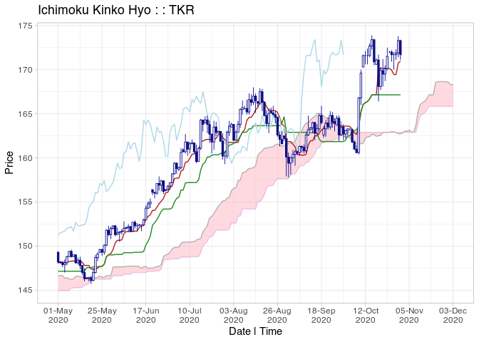

<!-- README.md is generated from README.Rmd. Please edit that file -->

# ichimoku 

<!-- badges: start -->

[](https://github.com/shikokuchuo/ichimoku/actions/workflows/R-CMD-check.yaml)
[](https://CRAN.R-project.org/package=ichimoku)
<!-- badges: end -->

Visualization and Tools for Ichimoku Kinko Hyo Strategies

An implementation of ‘Ichimoku Kinko Hyo’, also commonly known as ‘cloud
charts’. Static and interactive visualizations with tools for creating,
backtesting and development of quantitative ‘ichimoku’ strategies. As
described in Sasaki (1996, ISBN:4925152009), the technique is a
refinement on candlestick charting originating from Japan, now in
widespread use in technical analysis worldwide. Translating as
‘one-glance equilibrium chart’, it allows the price action and market
structure of financial securities to be determined ‘at-a-glance’.

## Installation

Install the released version of ichimoku from CRAN:

``` r
install.packages("ichimoku")
```

Or install the development version of ichimoku from GitHub with:

``` r
devtools::install_github("shikokuchuo/ichimoku")
```

## Example

Load package and sample price data:

``` r
library(ichimoku)
TKR <- sample_ohlc_data
```

#### Visualization

Simply `ichimoku()` and `plot()`:

``` r
cloud <- ichimoku(TKR)
plot(cloud, window = "2020-04/")
```



#### Strategies

`autostrat()` to automatically generate top-performing strategies:

``` r
autostrat(cloud, n = 3)
#>                        [,1]               [,2]                [,3]             
#> Strategy               "senkouB > tenkan" "cloudBase > kijun" "senkouB > kijun"
#> ---------------------  "----------"       "----------"        "----------"     
#> Strategy cuml return % 14.72              11.96               11.7             
#> Per period mean ret %  0.0886             0.0729              0.0714           
#> Periods in market      57                 38                  57               
#> Total trades           3                  3                   3                
#> Average trade length   19                 12.67               19               
#> Winning trades %       66.67              66.67               66.67            
#> Worst trade ret %      -0.31              -0.31               -0.31            
#> ---------------------  "----------"       "----------"        "----------"     
#> Benchmark cuml ret %   0.94               0.94                0.94             
#> Per period mean ret %  0.006              0.006               0.006            
#> Periods in market      155                155                 155              
#> ---------------------  "----------"       "----------"        "----------"     
#> Direction              "long"             "long"              "long"           
#> Start                  2020-04-02         2020-04-02          2020-04-02       
#> End                    2020-09-29         2020-09-29          2020-09-29       
#> Ticker                 "TKR"              "TKR"               "TKR"
```

## Reference

R package site: <https://shikokuchuo.net/ichimoku/>

CRAN page: <https://CRAN.R-project.org/package=ichimoku>
