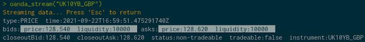

```{r, include = FALSE}
knitr::opts_chunk$set(
  collapse = TRUE,
  comment = "#>",
  fig.width = 7, fig.height = 5
)

```

## About OANDA fxTrade

ichimoku contains an interface, or binding, to the OANDA fxTrade API for the R language.

OANDA is a primary source of foreign exchange data used by corporations and governments around the world. The API can be used for retrieving historical and live streaming price data for major currencies, metals, commodities, government bonds and stock indices.

As an example of the financial data that is available: OHLC pricing data can be obtained for major forex pairs from the start of 2005 with granularity ranging from 5 seconds to monthly. For the total list of over 120 covered instruments please refer to the [Available Instruments](#available-instruments) section below.

Please note that 'OANDA' and 'fxTrade' are trademarks owned by OANDA Corporation, an entity unaffiliated with the ichimoku package.

## Registering with OANDA

The OANDA fxTrade API, as distinct to other OANDA data sources, is based upon its retail and professional trading offering of the same name. As such, access to the API requires an fxTrade account with OANDA and agreement to their API terms of use. 

Registering for a 'demo' or 'practice' account is entirely free at the time of writing and provides full access to the API. For registering an account, the following URL may be used: <https://www.oanda.com/forex-trading/>.

After successful registration, a link can be found on your OANDA fxTrade account profile page 'Manage API Access' (My Account -> My Services -> Manage API Access). From there, a personal access token to use with the OANDA API can be generated, as well as revoked. This access token will enable all the OANDA functions in this package.

Note: this package only contains functions for retrieving available instruments and price data. It does not contain code to implement any trading capability whatsoever. Hence using your access token with this package should be safe, even for live accounts. However, the access token can be used (outside of this package) for all operations on your account including placing orders and trades. It is therefore recommended, for maximum security, that you register for a demo/practice account and use the access token for that account even if you hold an existing live account with OANDA.

## Setting your OANDA API Key

If the 'keyring' package is available on your machine, the OANDA API key (personal access token) can be set once and saved in your system credential store by using `oanda_set_key()`. This will enable it to be retrieved automatically for all subsequent sessions.

If an access token is revoked and re-generated, please remember to set the API key again through the `oanda_set_key()` function.

## The OANDA Functions

All of the OANDA functions in the package are prefixed by 'oanda' for clarity and ease of use.

### `oanda()`

Retrieve pricing data from the OANDA fxTrade API.

The arguments to the function are phrased identically to that of the API itself where relevant:

- `instrument` a string containing the base currency and quote currency delimited by a '_' (for example "USD_JPY"). Use the `oanda_instruments()` function to return a list of all valid instruments
- `granularity` [default "D"] the granularity of the price data to fetch, one of "M", "W", "D", "H12", "H8", "H6", "H4", "H3", "H2", "H1", "M30", "M15", "M10", "M5", "M4", "M2", "M1", "S30", "S15", "S10", "S5"
- `count` (optional) the number of periods to return. The API supports a maximum of 5000 for each individual request, and defaults to 500 if not specified. If both 'from' and 'to' are specified, 'count' is ignored, as the time range combined with 'granularity' will determine the number of periods to return
- `from` (optional) the start of the time range for which to fetch price data, for example "2020-02-01"
- `to` (optional) the end of the time range for which to fetch price data, for example "2020-06-30"
- `price` [default "M"] the pricing component, one of "M" (midpoint), "B" (bid) or "A" (ask)
- `server` [default "practice"] select either the "practice" or "live" server depending on the account type held with OANDA
- `apikey` (optional) string containing the OANDA fxTrade API key (personal access token). This argument is designed for specifying a function that returns such a string rather than the string itself, which could be potentially unsecure. This allows other packages that provide secure storage of secrets to be used if preferred over 'keyring'

Note: if both `from` and `to` are specified and the request would result in over 5000 periods being returned, the function automatically prompts the user to confirm if multiple requests should be submitted. Unless the user response is "n" or "no", the data will proceed to be downloaded with rate limiting in place as per API best practices, and merged together into a single dataframe.

```{r oanda, eval=FALSE}
library(ichimoku)
oanda("USD_JPY", count = 3, from = "2010-11-01", price = "B")
```
```{r oanda2, echo=FALSE}
data.frame(
        time = c("2010-11-01 21:00:00",
                 "2010-11-02 21:00:00","2010-11-03 21:00:00"),
        open = c(80.275, 80.504, 80.632),
        high = c(81.504, 80.956, 81.585),
         low = c(80.225, 80.46, 80.594),
       close = c(80.501, 80.617, 81.069),
      volume = c(22291L, 13795L, 22204L),
    complete = c(TRUE, TRUE, TRUE)
)
```

The returned object is a dataframe with the following columns:
'time', 'open', 'high', 'low', 'close', 'volume' and 'complete'.

- **volume** should normally be disregarded as this reflects the trading volume registered by OANDA and may not be reflective of the broader market

- **complete** indicates whether the data period is complete or not. If TRUE, the values are historical and not subject to change. If FALSE, the period is ongoing and the values reflect the current snapshot and the final values may or may not differ

Important implementation notes:

- Incorporates automatic adjustment of the timestamps to end of period, as is customary for financial data. This means that, for example, today's pricing data (incomplete trading period) will have today's date as would be expected. In contrast, the raw data from the API has a timestamp of the start of the period

- The API data sometimes includes data for non-trading days with very low volumes. This is more common for older data and less so with more recent data. These may represent OTC trades that occurred over the OANDA platform, but nevertheless do not reflect market rates. These are automatically excluded from the data returned as they would otherwise produce spurious results if used with `ichimoku()`

### `oanda_stream()`

Connect to the OANDA fxTrade streaming API and stream a list of prices generated by OANDA.

Requires a single argument, the 'instrument' to stream data for (please refer to `oanda()` above).

The 'server' and 'apikey' arguments are also available if required.



The stream output contains injected ANSI escape codes to create the colour blocks in the console, but otherwise represents the raw data feed without omission. As this is a raw feed, please note that the returned times are in UTC.

The following should be noted from the streaming API documentation:

- Get a stream of Account Prices starting from when the request is made
- This pricing stream does not include every single price created for the Account, but instead will provide at most 4 prices per second (every 250 milliseconds) for each instrument being requested
- If more than one price is created for an instrument during the 250 millisecond window, only the price in effect at the end of the window is sent. This means that during periods of rapid price movement, subscribers to this stream will not be sent every price
- Pricing windows for different connections to the price stream are not all aligned in the same way (i.e. they are not all aligned to the top of the second). This means that during periods of rapid price movement, different subscribers may observe different prices depending on their alignment

### `oanda_chart()`

Create an updating real-time Ichimoku cloud chart. The refresh rate can be set for the chart to be updated down to every second. A plot of the ichimoku chart for the price data requested is output to the graphical device at each refresh interval.

The arguments are identical to `oanda()` above with the addition of:

- `refresh` set the refresh rate of the chart in seconds, with a minimum of 1
- `...` additional parameters passed onto `ichimoku()` for calculating the ichimoku cloud or `autoplot()` to set chart parameters
- `periods` [default c(9L, 26L, 52L)] a vector defining the length of periods used for the cloud. This parameter should not normally be modified as using other values would be invalid in the context of traditional Ichimoku analysis

The arguments 'from' and 'to' are excluded as they are not relevant in this context.

```{r oandachart, eval=FALSE}
# For a live Palladium price chart:
oanda_chart("XPD_USD")
```

If focus is not initially on the plot pane (in RStudio), please switch to it to view the chart.

Note also that the periods displayed on the chart will be fewer than the 'count' specified. This is by design to ensure a full cloud is always displayed (i.e. there are no missing values for certain cloud lines at the start of the data). If using the default cloud periods, the first 77 datapoints will be excluded from the chart. Please take this into account when setting the 'count' parameter.

### `oanda_studio()`

Create an interactive session in an R Shiny app for working with real-time Ichimoku cloud charts. Provides a live analysis environment where parameters may be set interactively as required. The cursor infotip provides ready access to the data directly from the chart.

As all parameters can be set interactively in-app, the function may simply be launched as `oanda_studio()` without specifying any arguments. Otherwise, parameters may be set beforehand in the same way as `oanda_chart()`.

```{r oandastudio, eval=FALSE}
oanda_studio()
```


The following additional parameters can be used to customise the behaviour of the Shiny environment:

- `...` additional arguments passed to `ichimoku()` for calculating the ichimoku cloud, `autoplot()` to set chart parameters, or the 'options' argument of `shiny::shinyApp()`
- `launch.browser` [default TRUE] If TRUE, the system’s default web browser will be launched automatically after the app is started. The value of this argument can also be a function to call with the application’s URL. To use the default Shiny viewer in RStudio, please specify `getOption("shiny.launch.browser")`

#### Downloading Data

The ichimoku object underlying the live cloud chart can be saved by selecting the Data Archive button. 

This button uses `archive()` to save the ichimoku object to disk. The filename will be of the form: `instrument_granularity_price_count`, e.g. `USD_JPY_H4_M_300`. If confirmed, the file is saved to the browser's default download location.

To read back the file, use `archive()` supplying the quoted file path / name.

## Available Instruments

The list of financial instruments available for your account may be retrieved by `oanda_instruments()`. The available instruments are also automatically populated as an input in `oanda_studio()`.

The list below serves as a reference only and may differ from those actually available for your account type and/or country/region.

```{r oandainstruments, eval=FALSE}
oanda_instruments()
```
```{r instruments, echo=FALSE}
data.frame(
  stringsAsFactors = FALSE,
              name = c("AU200_AUD","AUD_CAD",
                       "AUD_CHF","AUD_HKD","AUD_JPY","AUD_NZD","AUD_SGD","AUD_USD",
                       "BCO_USD","CAD_CHF","CAD_HKD","CAD_JPY","CAD_SGD",
                       "CHF_HKD","CHF_JPY","CHF_ZAR","CN50_USD","CORN_USD",
                       "DE10YB_EUR","DE30_EUR","EU50_EUR","EUR_AUD",
                       "EUR_CAD","EUR_CHF","EUR_CZK","EUR_DKK","EUR_GBP","EUR_HKD",
                       "EUR_HUF","EUR_JPY","EUR_NOK","EUR_NZD","EUR_PLN",
                       "EUR_SEK","EUR_SGD","EUR_TRY","EUR_USD","EUR_ZAR",
                       "FR40_EUR","GBP_AUD","GBP_CAD","GBP_CHF","GBP_HKD",
                       "GBP_JPY","GBP_NZD","GBP_PLN","GBP_SGD","GBP_USD",
                       "GBP_ZAR","HK33_HKD","HKD_JPY","IN50_USD","JP225_USD",
                       "NAS100_USD","NATGAS_USD","NL25_EUR","NZD_CAD","NZD_CHF",
                       "NZD_HKD","NZD_JPY","NZD_SGD","NZD_USD","SG30_SGD",
                       "SGD_CHF","SGD_JPY","SOYBN_USD","SPX500_USD",
                       "SUGAR_USD","TRY_JPY","TWIX_USD","UK100_GBP","UK10YB_GBP",
                       "US2000_USD","US30_USD","USB02Y_USD","USB05Y_USD",
                       "USB10Y_USD","USB30Y_USD","USD_CAD","USD_CHF","USD_CNH",
                       "USD_CZK","USD_DKK","USD_HKD","USD_HUF","USD_INR",
                       "USD_JPY","USD_MXN","USD_NOK","USD_PLN","USD_SEK",
                       "USD_SGD","USD_THB","USD_TRY","USD_ZAR","WHEAT_USD",
                       "WTICO_USD","XAG_AUD","XAG_CAD","XAG_CHF","XAG_EUR",
                       "XAG_GBP","XAG_HKD","XAG_JPY","XAG_NZD","XAG_SGD",
                       "XAG_USD","XAU_AUD","XAU_CAD","XAU_CHF","XAU_EUR","XAU_GBP",
                       "XAU_HKD","XAU_JPY","XAU_NZD","XAU_SGD","XAU_USD",
                       "XAU_XAG","XCU_USD","XPD_USD","XPT_USD","ZAR_JPY"),
       displayName = c("Australia 200","AUD/CAD",
                       "AUD/CHF","AUD/HKD","AUD/JPY","AUD/NZD","AUD/SGD",
                       "AUD/USD","Brent Crude Oil","CAD/CHF","CAD/HKD","CAD/JPY",
                       "CAD/SGD","CHF/HKD","CHF/JPY","CHF/ZAR","China A50",
                       "Corn","Bund","Germany 30","Europe 50","EUR/AUD",
                       "EUR/CAD","EUR/CHF","EUR/CZK","EUR/DKK","EUR/GBP",
                       "EUR/HKD","EUR/HUF","EUR/JPY","EUR/NOK","EUR/NZD",
                       "EUR/PLN","EUR/SEK","EUR/SGD","EUR/TRY","EUR/USD",
                       "EUR/ZAR","France 40","GBP/AUD","GBP/CAD","GBP/CHF",
                       "GBP/HKD","GBP/JPY","GBP/NZD","GBP/PLN","GBP/SGD","GBP/USD",
                       "GBP/ZAR","Hong Kong 33","HKD/JPY","India 50",
                       "Japan 225","US Nas 100","Natural Gas","Netherlands 25",
                       "NZD/CAD","NZD/CHF","NZD/HKD","NZD/JPY","NZD/SGD",
                       "NZD/USD","Singapore 30","SGD/CHF","SGD/JPY","Soybeans",
                       "US SPX 500","Sugar","TRY/JPY","Taiwan Index","UK 100",
                       "UK 10Y Gilt","US Russ 2000","US Wall St 30",
                       "US 2Y T-Note","US 5Y T-Note","US 10Y T-Note","US T-Bond",
                       "USD/CAD","USD/CHF","USD/CNH","USD/CZK","USD/DKK",
                       "USD/HKD","USD/HUF","USD/INR","USD/JPY","USD/MXN",
                       "USD/NOK","USD/PLN","USD/SEK","USD/SGD","USD/THB",
                       "USD/TRY","USD/ZAR","Wheat","West Texas Oil","Silver/AUD",
                       "Silver/CAD","Silver/CHF","Silver/EUR","Silver/GBP",
                       "Silver/HKD","Silver/JPY","Silver/NZD","Silver/SGD",
                       "Silver","Gold/AUD","Gold/CAD","Gold/CHF","Gold/EUR",
                       "Gold/GBP","Gold/HKD","Gold/JPY","Gold/NZD","Gold/SGD",
                       "Gold","Gold/Silver","Copper","Palladium","Platinum",
                       "ZAR/JPY"),
                type = c("CFD","CURRENCY","CURRENCY",
                       "CURRENCY","CURRENCY","CURRENCY","CURRENCY",
                       "CURRENCY","CFD","CURRENCY","CURRENCY","CURRENCY","CURRENCY",
                       "CURRENCY","CURRENCY","CURRENCY","CFD","CFD","CFD",
                       "CFD","CFD","CURRENCY","CURRENCY","CURRENCY",
                       "CURRENCY","CURRENCY","CURRENCY","CURRENCY","CURRENCY",
                       "CURRENCY","CURRENCY","CURRENCY","CURRENCY","CURRENCY",
                       "CURRENCY","CURRENCY","CURRENCY","CURRENCY","CFD",
                       "CURRENCY","CURRENCY","CURRENCY","CURRENCY","CURRENCY",
                       "CURRENCY","CURRENCY","CURRENCY","CURRENCY",
                       "CURRENCY","CFD","CURRENCY","CFD","CFD","CFD","CFD","CFD",
                       "CURRENCY","CURRENCY","CURRENCY","CURRENCY",
                       "CURRENCY","CURRENCY","CFD","CURRENCY","CURRENCY","CFD",
                       "CFD","CFD","CURRENCY","CFD","CFD","CFD","CFD","CFD",
                       "CFD","CFD","CFD","CFD","CURRENCY","CURRENCY",
                       "CURRENCY","CURRENCY","CURRENCY","CURRENCY","CURRENCY",
                       "CURRENCY","CURRENCY","CURRENCY","CURRENCY","CURRENCY",
                       "CURRENCY","CURRENCY","CURRENCY","CURRENCY",
                       "CURRENCY","CFD","CFD","METAL","METAL","METAL","METAL",
                       "METAL","METAL","METAL","METAL","METAL","METAL",
                       "METAL","METAL","METAL","METAL","METAL","METAL","METAL",
                       "METAL","METAL","METAL","METAL","CFD","METAL",
                       "METAL","CURRENCY")
)
```

## Caching Implementation

The package retrieves the following once only during a single R session (the first time they are used) and caches the variables for further use throughout the session:

- OANDA fxTrade API key
- OANDA fxTrade account associated with an fxTrade API key
- OANDA list of available instruments

If for any reason these become invalid or outdated, please restart your R session to enable these variables to be refreshed.

## References

‘OANDA’ and ‘fxTrade’ are trademarks owned by OANDA Corporation, an entity unaffiliated with the ichimoku package.

OANDA fxTrade API developer website: <https://developer.oanda.com/>.

Gao, C. (2021), *ichimoku: Visualization and Tools for Ichimoku Kinko Hyo Strategies*. R package version 1.1.6, <https://CRAN.R-project.org/package=ichimoku>.

---
