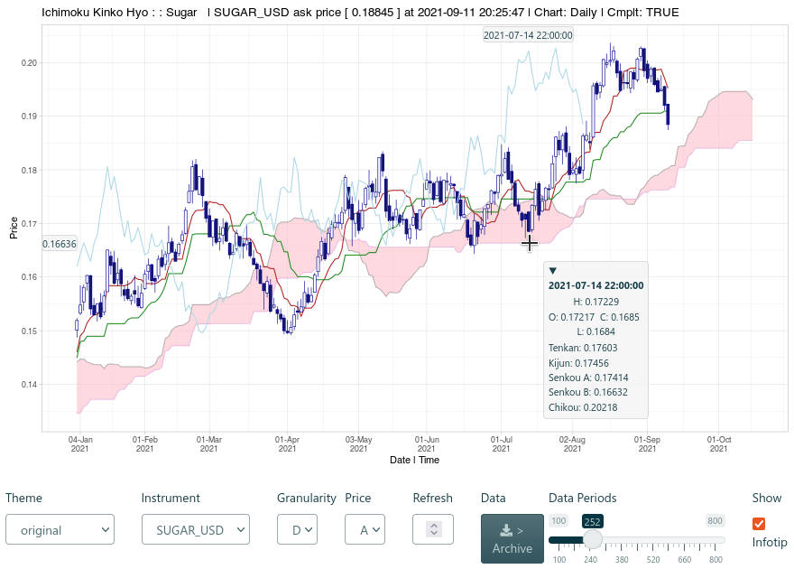

```{r, include = FALSE}
knitr::opts_chunk$set(
  collapse = TRUE,
  comment = "#>",
  fig.width = 7, fig.height = 5
)

```

## About OANDA fxTrade

ichimoku provides an R language interface to the OANDA fxTrade API.

OANDA is a primary source of foreign exchange data used by investors, corporations and governments globally. The API can be used for retrieving historical and live streaming price data for major currencies, metals, commodities, government bonds and stock indices.

As an example of available financial data: OHLC prices for major forex pairs can be obtained from the start of 2005 with granularity ranging from 5 seconds to monthly. For the total list of over 120 covered instruments please refer to the [Available Instruments](#available-instruments) section below.

Please note that 'OANDA' and 'fxTrade' are trademarks owned by OANDA Corporation, an entity unaffiliated with the ichimoku package, its authors or copyright holders.

## Registering with OANDA

The OANDA fxTrade API, as distinct to other OANDA data sources, is based upon its retail / professional trading offering of the same name. As such, access to the API requires an fxTrade account with OANDA and agreement to their API terms of use. 

Registering for a 'demo' or 'practice' account is entirely free at the time of writing and provides full access to the API. For registering an account, the following URL may be used: <https://www.oanda.com/forex-trading/>.

After successful registration, a link can be found on your OANDA fxTrade account profile page 'Manage API Access' (My Account -> My Services -> Manage API Access). From there, a personal access token to use with the OANDA API can be generated, as well as revoked. This access token will enable all the OANDA functions in this package.

## Setting your OANDA API Key

If the 'keyring' package is installed, the OANDA API key (personal access token) can be set once and saved in your system credential store by using `oanda_set_key()`. This will enable it to be retrieved automatically for all subsequent sessions.

Separate keys can be set for practice and live accounts; please choose the correct account type when prompted.

If an access token is revoked and re-generated, please remember to set the API key again through the `oanda_set_key()` function.

## Using a Live Account

If you are using an access token for a live (real money) account, you will want to call `oanda_switch()` at the beginning of each session; this switches the default server from the practice server to the live server. Settings will only persist until the end of the session.

```{r oandaswitch}
library(ichimoku)

oanda_switch()
```

Note: this package only contains functions for retrieving available instruments and price data. It does not contain code to implement any trading capability whatsoever. Please be aware however, that a personal access token can be used (outside of this package) for all operations on your account including placing orders and trades, and appropriate precautions should be taken when using your live account token.

## The OANDA Functions

All of the OANDA functions in the package are prefixed by 'oanda' for clarity.

Functions may be called interactively without any arguments, e.g. `oanda_stream()` or `oanda_view()`, in which case you will be further prompted to enter required arguments; as opposed to when specifying such arguments normally, these should be entered unquoted i.e. without any surrounding "".

For all functions, the 'instrument' argument is case-insensitive and the delimiter can be either '_' or '-', such that both `oanda("USD_JPY")` and `oanda("usd-jpy")` would be acceptable.

### `oanda()`

Retrieve pricing data from the OANDA fxTrade API.

The arguments to the function are phrased identically to that of the API itself where relevant:

- `instrument` string containing the base currency and quote currency delimited by '_' or '-' (e.g. "USD_JPY" or "usd-jpy"). Use the `oanda_instruments()` function to return a list of all valid instruments
- `granularity` [default "D"] the granularity of the price data to fetch, one of "M", "W", "D", "H12", "H8", "H6", "H4", "H3", "H2", "H1", "M30", "M15", "M10", "M5", "M4", "M2", "M1", "S30", "S15", "S10", "S5"
- `count` (optional) the number of periods to return. The API supports a maximum of 5000 for each individual request, and defaults to 500 if not specified. If both 'from' and 'to' are specified, 'count' is ignored, as the time range combined with 'granularity' will determine the number of periods to return
- `from` (optional) the start of the time range for which to fetch price data, for example "2020-02-01"
- `to` (optional) the end of the time range for which to fetch price data, for example "2020-06-30"
- `price` [default "M"] the pricing component, one of "M" (midpoint), "B" (bid) or "A" (ask)
- `server` (optional) Specify the "practice" or "live" server according to the account type held with OANDA. If not specified, will default to "practice", unless this has been changed by `oanda_switch()`.
- `apikey` (optional) string containing the OANDA fxTrade API key (personal access token). Does not need to be specified if already stored by `oanda_set_key()`. This argument is designed for specifying a function that returns such a string rather than the string itself, which could be potentially unsecure. This allows other packages that provide secure storage of secrets to be used if preferred over 'keyring'
- `quietly` if set to TRUE, will suppress printing of output to the console and return quietly

Note: if both `from` and `to` are specified and the request would result in over 5000 periods being returned, the function prompts the user to confirm if multiple requests should be submitted. Unless the user response is "n" or "no", the data will proceed to be downloaded in batches and merged together into a single dataframe. The function is safe for use in non-interactive settings as in such cases the download will proceed automatically without prompting.

```{r oanda, eval=FALSE}
oanda("USD_JPY", count = 3, from = "2010-11-01", price = "B")
#>                  time   open   high    low  close volume complete
#> 1 2010-11-01 21:00:00 80.275 81.504 80.225 80.501  22291     TRUE
#> 2 2010-11-02 21:00:00 80.504 80.956 80.460 80.617  13795     TRUE
#> 3 2010-11-03 21:00:00 80.632 81.585 80.594 81.069  22204     TRUE
```

The returned object is a dataframe with the following columns:
'time', 'open', 'high', 'low', 'close', 'volume' and 'complete'.

- **volume** should be used with caution as this reflects the trading volume registered by OANDA and may not be reflective of the broader market

- **complete** indicates whether the data period is complete or not. If TRUE, the values are historical and not subject to change. If FALSE, the period is ongoing and the values reflect the current snapshot whilst final values may or may not differ

Important implementation notes:

- Incorporates automatic adjustment of the timestamps to end of period, as is customary for financial data. This means that, for example, today's pricing data (incomplete trading period) will have today's date as would be expected. In contrast, the raw data from the API has a timestamp of the start of the period

- The API data sometimes includes data for non-trading days with very low volumes. This is more common for older data and less so with more recent data. These may represent OTC trades that occurred over the OANDA platform, but nevertheless do not reflect market rates. These are automatically excluded from the data returned as they would otherwise produce spurious results when used with `ichimoku()`

### `oanda_chart()`

Create an updating real-time Ichimoku cloud chart. The refresh rate can be set for the chart to be updated down to every second. A plot of the ichimoku chart for the price data requested is output to the graphical device at each refresh interval.

The arguments are identical to `oanda()` above with the addition of:

- `refresh` [default 5] set the refresh rate of the chart in seconds, with a minimum of 1
- `limit` (optional) specify a time in seconds by which to limit the session. The session will end with data returned automatically after the specified time has elapsed
- `...` additional parameters passed onto `ichimoku()` for calculating the ichimoku cloud or `autoplot()` to set chart parameters
- `periods` [default c(9L, 26L, 52L)] a vector defining the length of periods used for the cloud. This parameter should not normally be modified as using other values would be invalid in the context of traditional Ichimoku analysis

The arguments 'from' and 'to' are excluded as they are not relevant in this context.

```{r oandac, eval=FALSE}
# For a live Palladium price chart:
oanda_chart("XPD_USD")
```

In RStudio, please switch to the plots plane to view the chart if not already in focus.

Note that the periods displayed on the chart will be fewer than the 'count' specified - using default cloud periods, the first 77 datapoints will be excluded. This is by design to ensure a full cloud is displayed (i.e. there are no missing values for any cloud lines at the start of the data). Please take this into account when setting the 'count' parameter.

On exit from the function, the ichimoku object underlying the chart will be returned (invisibly). This allows the data to be saved simply by assigning to an object.

```{r oandacs, eval=FALSE}
# To access the data, simply assign the return value to an object:
cloud <- oanda_chart("XPD_USD")
```

### `oanda_studio()`

Create an interactive R Shiny session for working with real-time Ichimoku cloud charts. Provides a live analysis environment where parameters may be set interactively as required. The cursor infotip provides ready access to the data directly from the chart.

As all parameters can be set interactively in-app, `oanda_studio()` may be called without specifying any arguments. Otherwise, parameters may be set beforehand in the same way as `oanda_chart()`.

```{r oandas, eval=FALSE}
oanda_studio()
```


The following additional parameters can be used to customise the behaviour of the Shiny environment:

- `new.process` [default FALSE] if TRUE, will start the shiny session in a new R process, unblocking the current process and allowing continued use of the R console.
- `...` additional arguments passed to `ichimoku()` for calculating the ichimoku cloud, `autoplot()` to set chart parameters, or the 'options' argument of `shiny::shinyApp()`
- `launch.browser` [default TRUE] If TRUE, the system’s default web browser will be launched automatically after the app is started. The value of this argument can also be a function to call with the application’s URL. To use the default Shiny viewer in RStudio, please specify `getOption("shiny.launch.browser")`

#### Downloading Data

The ichimoku object underlying the live cloud chart can be saved by selecting the Data Archive button. 

This button uses `archive()` to save the ichimoku object to disk. The filename will be of the form: `instrument_granularity_price.rda`, e.g. `SUGAR_USD_D_A.rda`. If confirmed, the file is saved to the browser's default download location. Note that files with the same name are not overwritten but instead the filename is made unique.

To read back the file, use `archive()`:

```{r archive, eval=FALSE}
# Supply the quoted file path / name, for example:
cloud <- archive("~/Downloads/SUGAR_USD_D_A.rda")

# Or alternatively, choose the saved file interactively using a system dialog:
cloud <- archive()
```

### `oanda_stream()`

Connect to the OANDA fxTrade streaming API and stream a list of prices generated by OANDA.

The arguments are as follows:

- `instrument` the instrument to stream data for
- `display` [default 7L] specify an integer to customise the number of rows to display in the console at any one time
- `limit` (optional) specify a time in seconds by which to limit the streaming session. The session will end with data returned automatically after the specified time has elapsed

The 'server' and 'apikey' arguments are also available if required.

```{r oandastream, eval=FALSE}
# Streaming session will end with data automatically returned after 600 secs (10 mins):
data <- oanda_stream("UK10YB_GBP", limit = 600)
#> Streaming data... Press 'Esc' to return
#>    type                time           bids           asks closeoutBid closeoutAsk    status tradeable
#> 1 PRICE 2022-02-21 12:31:20 121.712, 10000 121.742, 10000     121.712     121.742 tradeable      TRUE
#> 2 PRICE 2022-02-21 12:31:37 121.722, 10000 121.752, 10000     121.722     121.752 tradeable      TRUE
#> 3 PRICE 2022-02-21 12:31:52 121.712, 10000 121.742, 10000     121.712     121.742 tradeable      TRUE
#> 4 PRICE 2022-02-21 12:32:12 121.722, 10000 121.752, 10000     121.722     121.752 tradeable      TRUE
#> 5 PRICE 2022-02-21 12:32:15 121.712, 10000 121.742, 10000     121.712     121.742 tradeable      TRUE
#> 6 PRICE 2022-02-21 12:32:27 121.722, 10000 121.752, 10000     121.722     121.752 tradeable      TRUE
#> 7 PRICE 2022-02-21 12:33:24 121.712, 10000 121.742, 10000     121.712     121.742 tradeable      TRUE
#>   instrument
#> 1 UK10YB_GBP
#> 2 UK10YB_GBP
#> 3 UK10YB_GBP
#> 4 UK10YB_GBP
#> 5 UK10YB_GBP
#> 6 UK10YB_GBP
#> 7 UK10YB_GBP
```

Use the 'Esc' key to stop the stream and return the session data. Assign the return value to an object if you wish to retain the data.

Note: only messages of type 'PRICE' are processed. Messages of type 'HEARTBEAT' consisting of only a timestamp are discarded.

The following should be noted from the streaming API documentation:

 - Pricing stream does not include every single price created for the Account
 - At most 4 prices are sent per second (every 250 milliseconds) for each instrument
 - If more than one price is created during the 250 millisecond window, only the price in effect at the end of the window is sent
 - This means that during periods of rapid price movement, not every price is sent
 - Pricing windows for different connections to the stream are not all aligned in the same way (e.g. to the top of the second)
 - This means that during periods of rapid price movement, different prices may be observed depending on the alignment for the connection

### `oanda_quote()`

A convenience function that outputs to the console the latest one-line price quote for an instrument.

The output format is as follows: instrument, timestamp, daily open, high, low and last prices, daily percentage change (from the open), and the pricing component (M for mid, B for bid, A for ask).

```{r oandaq, eval = FALSE}
oanda_quote("USD_JPY")
#> USD_JPY 2021-10-05 16:29:44 open: 110.931  high: 111.564  low: 110.871  last: 111.398  %chg: 0.421 M
```

### `oanda_view()`

Prints a snapshot overview of the selected market, showing the relative performance of all constituents.

The available markets are : 'allfx' for all available currencies, 'bonds' for government bonds, 'commodities' for commodities, 'fx' for major currency pairs, 'metals' for metals and 'stocks' for global stock markets. As partial matching is enabled, it is possible to type just the first letter e.g. 'c' for commodities.

The first retrieved timestamp and the pricing component are printed, followed by the dataframe showing similar data to `oanda_quote()` for all instruments in the selected market. The data is ordered by the daily percentage change, from the most positive to the most negative.

```{r oandav, eval = FALSE}
oanda_view()
Enter market [a]llfx [b]onds [c]ommodities [f]x [m]etals [s]tocks: c
#> Retrieving commodities [..........]
#> 2021-12-11 01:58:21 / M
#>                  open      high        low       last    %chg
#> NATGAS_USD    3.76200    3.9260    3.72400    3.85200  2.3923
#> BCO_USD      74.52600   76.2310   74.32600   75.88000  1.8168
#> WTICO_USD    70.91200   72.5540   70.55400   72.19000  1.8022
#> WHEAT_USD     7.67200    7.7710    7.57100    7.72700  0.7169
#> XPT_USD     930.20200  939.6000  924.29400  936.43800  0.6704
#> SOYBN_USD    12.63500   12.7580   12.58800   12.67800  0.3403
#> SUGAR_USD     0.19274    0.1948    0.19176    0.19334  0.3113
#> CORN_USD      5.89800    5.9410    5.86800    5.90200  0.0678
#> XCU_USD       4.30292    4.3479    4.26536    4.28361 -0.4488
#> XPD_USD    1805.14800 1815.1260 1729.61100 1752.81200 -2.8993
```

### `oanda_orders()` / `oanda_positions()`

Provides a summary of the aggregate orders/positions held by OANDA fxTrade clients at each price level.

'instrument' is a required argument. The latest order/position book is retrieved unless the optional argument 'time' is used to specify a time for which to retrieve the order/position book.

The data is returned as a dataframe, with parameters saved as attributes which can be viewed with `look()`. A chart showing the percentage long and short orders/positions at each price level is output to the graphical device.

```{r oandapos, eval=FALSE}
df <- oanda_positions("GBP_JPY")
```

```{r oandaposchart, echo=FALSE}

df <- structure(list(price = c(124.75, 124.85, 124.9, 124.95, 125.05, 
125.2, 125.25, 125.3, 125.35, 125.4, 125.5, 125.6, 125.7, 125.85, 
126, 126.2, 126.4, 126.5, 126.55, 126.65, 126.7, 126.75, 126.85, 
126.9, 126.95, 127, 127.05, 127.1, 127.15, 127.2, 127.25, 127.3, 
127.35, 127.4, 127.45, 127.5, 127.55, 127.6, 127.65, 127.7, 127.75, 
127.85, 127.9, 127.95, 128, 128.05, 128.1, 128.15, 128.2, 128.25, 
128.3, 128.35, 128.4, 128.45, 128.5, 128.55, 128.6, 128.65, 128.7, 
128.75, 128.8, 128.85, 128.9, 128.95, 129, 129.05, 129.1, 129.15, 
129.2, 129.25, 129.3, 129.35, 129.4, 129.45, 129.5, 129.55, 129.6, 
129.65, 129.7, 129.75, 129.8, 129.85, 129.9, 129.95, 130, 130.05, 
130.1, 130.15, 130.2, 130.25, 130.3, 130.35, 130.4, 130.45, 130.5, 
130.55, 130.6, 130.65, 130.7, 130.75, 130.8, 130.85, 130.9, 130.95, 
131, 131.05, 131.1, 131.15, 131.2, 131.25, 131.3, 131.35, 131.4, 
131.45, 131.5, 131.55, 131.6, 131.65, 131.7, 131.75, 131.8, 131.85, 
131.9, 131.95, 132, 132.05, 132.1, 132.15, 132.2, 132.25, 132.3, 
132.35, 132.4, 132.45, 132.5, 132.55, 132.6, 132.65, 132.7, 132.75, 
132.8, 132.85, 132.9, 132.95, 133, 133.05, 133.1, 133.15, 133.2, 
133.25, 133.3, 133.35, 133.4, 133.45, 133.5, 133.55, 133.6, 133.65, 
133.7, 133.75, 133.8, 133.85, 133.9, 133.95, 134, 134.05, 134.1, 
134.15, 134.2, 134.25, 134.3, 134.35, 134.4, 134.45, 134.5, 134.55, 
134.6, 134.65, 134.7, 134.75, 134.8, 134.85, 134.9, 134.95, 135, 
135.05, 135.1, 135.15, 135.2, 135.25, 135.3, 135.35, 135.4, 135.45, 
135.5, 135.55, 135.6, 135.65, 135.7, 135.75, 135.8, 135.85, 135.9, 
135.95, 136, 136.05, 136.1, 136.15, 136.2, 136.25, 136.3, 136.35, 
136.4, 136.45, 136.5, 136.55, 136.6, 136.65, 136.7, 136.75, 136.8, 
136.85, 136.9, 136.95, 137, 137.05, 137.1, 137.15, 137.2, 137.25, 
137.3, 137.35, 137.4, 137.45, 137.5, 137.55, 137.6, 137.65, 137.7, 
137.75, 137.8, 137.85, 137.9, 137.95, 138, 138.05, 138.1, 138.15, 
138.2, 138.25, 138.3, 138.35, 138.4, 138.45, 138.5, 138.55, 138.6, 
138.65, 138.7, 138.75, 138.8, 138.85, 138.9, 138.95, 139, 139.05, 
139.1, 139.15, 139.2, 139.25, 139.3, 139.35, 139.4, 139.45, 139.5, 
139.55, 139.6, 139.65, 139.7, 139.75, 139.8, 139.85, 139.9, 139.95, 
140, 140.05, 140.1, 140.15, 140.2, 140.25, 140.3, 140.35, 140.4, 
140.45, 140.5, 140.55, 140.6, 140.65, 140.7, 140.75, 140.8, 140.85, 
140.9, 140.95, 141, 141.05, 141.1, 141.15, 141.2, 141.25, 141.3, 
141.35, 141.4, 141.45, 141.5, 141.55, 141.6, 141.65, 141.7, 141.75, 
141.8, 141.85, 141.9, 141.95, 142, 142.05, 142.1, 142.15, 142.2, 
142.25, 142.3, 142.35, 142.4, 142.45, 142.5, 142.55, 142.6, 142.65, 
142.7, 142.75, 142.8, 142.85, 142.9, 142.95, 143, 143.05, 143.1, 
143.15, 143.2, 143.25, 143.3, 143.35, 143.4, 143.45, 143.5, 143.55, 
143.6, 143.65, 143.7, 143.75, 143.8, 143.85, 143.9, 143.95, 144, 
144.05, 144.1, 144.15, 144.2, 144.25, 144.3, 144.35, 144.4, 144.45, 
144.5, 144.55, 144.6, 144.65, 144.7, 144.75, 144.8, 144.85, 144.9, 
144.95, 145, 145.05, 145.1, 145.15, 145.2, 145.25, 145.3, 145.35, 
145.4, 145.45, 145.5, 145.55, 145.6, 145.65, 145.7, 145.75, 145.8, 
145.85, 145.9, 145.95, 146, 146.05, 146.1, 146.15, 146.2, 146.25, 
146.3, 146.35, 146.4, 146.45, 146.5, 146.55, 146.6, 146.65, 146.7, 
146.75, 146.8, 146.85, 146.9, 146.95, 147, 147.05, 147.1, 147.15, 
147.2, 147.25, 147.3, 147.35, 147.4, 147.45, 147.5, 147.55, 147.6, 
147.65, 147.7, 147.75, 147.8, 147.85, 147.9, 147.95, 148, 148.05, 
148.1, 148.15, 148.2, 148.25, 148.3, 148.35, 148.4, 148.45, 148.5, 
148.55, 148.6, 148.65, 148.7, 148.75, 148.8, 148.85, 148.9, 148.95, 
149, 149.05, 149.1, 149.15, 149.2, 149.25, 149.3, 149.35, 149.4, 
149.45, 149.5, 149.55, 149.6, 149.65, 149.7, 149.75, 149.8, 149.85, 
149.9, 149.95, 150, 150.05, 150.1, 150.15, 150.2, 150.25, 150.3, 
150.35, 150.4, 150.45, 150.5, 150.55, 150.6, 150.65, 150.7, 150.75, 
150.8, 150.85, 150.9, 150.95, 151, 151.05, 151.1, 151.15, 151.2, 
151.25, 151.3, 151.35, 151.4, 151.45, 151.5, 151.55, 151.6, 151.65, 
151.7, 151.75, 151.8, 151.85, 151.9, 151.95, 152, 152.05, 152.1, 
152.15, 152.2, 152.25, 152.3, 152.35, 152.4, 152.45, 152.5, 152.55, 
152.6, 152.65, 152.7, 152.75, 152.8, 152.85, 152.9, 152.95, 153, 
153.05, 153.1, 153.15, 153.2, 153.25, 153.3, 153.35, 153.4, 153.45, 
153.5, 153.55, 153.6, 153.65, 153.7, 153.75, 153.8, 153.85, 153.9, 
153.95, 154, 154.05, 154.1, 154.15, 154.2, 154.25, 154.3, 154.35, 
154.4, 154.45, 154.5, 154.55, 154.6, 154.65, 154.7, 154.75, 154.8, 
154.85, 154.9, 154.95, 155, 155.05, 155.1, 155.15, 155.2, 155.25, 
155.3, 155.35, 155.4, 155.45, 155.5, 155.55, 155.6, 155.65, 155.7, 
155.75, 155.8, 155.85, 155.9, 155.95, 156, 156.05, 156.1, 156.15, 
156.2, 156.25, 156.3, 156.35, 156.4, 156.45, 156.5, 156.55, 156.6, 
156.65, 156.7, 156.75, 156.8, 156.85, 156.9, 156.95, 157, 157.05, 
157.1, 157.15, 157.2, 157.25, 157.3, 157.35, 157.4, 157.45, 157.5, 
157.55, 157.6, 157.65, 157.7, 157.75, 157.8, 157.85, 157.9, 157.95, 
158, 158.05, 158.1, 158.15, 158.2, 158.3, 158.4, 158.6, 158.65, 
158.7, 158.85, 158.9, 159, 159.15, 159.25, 159.3, 159.35, 159.45, 
159.6, 159.7, 159.75, 159.8, 159.85, 159.95, 160, 160.1, 160.15, 
160.2, 160.35, 160.4, 160.45, 160.5, 160.55, 160.6, 160.7, 160.75, 
160.85, 160.95, 161.05, 161.1, 161.2, 161.25, 161.35, 161.45, 
161.55, 161.6, 161.65, 161.7, 161.8, 161.9, 161.95, 162, 162.2, 
162.3, 162.45, 162.7, 162.75, 162.85, 162.95, 163.6, 163.65, 
163.85, 165.05, 165.1, 165.25, 165.75, 166.7, 167.75, 168.4, 
169.15, 169.9, 170.35, 171.75, 172.05, 172.85, 175.9, 176.05, 
177.25, 178.1, 179.5, 179.7, 179.8, 182.6, 182.75, 182.8, 182.85, 
182.95, 183, 183.35, 183.55, 184.25, 184.3, 185.15, 185.3, 186.65, 
186.7, 186.75, 186.8, 187.7, 187.85), long = c(0.014, 0, 0.007, 
0.007, 0, 0.007, 0, 0, 0, 0.007, 0.007, 0.007, 0.007, 0.007, 
0.014, 0.007, 0.007, 0, 0.014, 0.014, 0.007, 0.007, 0.007, 0.014, 
0.0281, 0.0211, 0.014, 0.014, 0.0281, 0.0211, 0.007, 0.014, 0.0211, 
0.014, 0.007, 0.007, 0.007, 0.0351, 0.014, 0.0351, 0.007, 0.007, 
0.0211, 0.014, 0.014, 0.0211, 0.0351, 0.0211, 0.0211, 0.007, 
0.0561, 0.0281, 0.0211, 0.0281, 0.0491, 0.014, 0.014, 0.0281, 
0.007, 0.007, 0.0281, 0.014, 0.0211, 0.007, 0.0351, 0.0281, 0.0281, 
0.0211, 0.014, 0.0351, 0.0211, 0.0561, 0.0421, 0.0351, 0.0211, 
0.0281, 0.0351, 0.0281, 0.0211, 0.014, 0.0351, 0.0281, 0.0561, 
0, 0.0211, 0.014, 0.0211, 0.0211, 0.0211, 0.0211, 0.0281, 0.0211, 
0.0491, 0.0632, 0.007, 0.0281, 0.0491, 0.0281, 0.0702, 0.0281, 
0.0211, 0.0632, 0.0632, 0.0561, 0.0561, 0.0632, 0.0772, 0.0772, 
0.0351, 0.0421, 0.0491, 0.0281, 0.0421, 0.0632, 0.0421, 0.0561, 
0.0421, 0.0351, 0.0561, 0.0421, 0.0421, 0.0912, 0.0491, 0.0702, 
0.0632, 0.0561, 0.0421, 0.0632, 0.0842, 0.1333, 0.0632, 0.0561, 
0.1123, 0.0912, 0.0702, 0.0702, 0.0842, 0.0912, 0.0632, 0.0702, 
0.0912, 0.2175, 0.0982, 0.1614, 0.2386, 0.0491, 0.0772, 0.0632, 
0.0982, 0.1263, 0.0632, 0.0912, 0.0982, 0.0772, 0.0351, 0.0211, 
0.0702, 0.0632, 0.0281, 0.0772, 0.0421, 0.0702, 0.0561, 0.0491, 
0.0702, 0.0912, 0.1123, 0.1263, 0.1333, 0.1123, 0.1404, 0.1053, 
0.1263, 0.1474, 0.0912, 0.1263, 0.1474, 0.1614, 0.1404, 0.1193, 
0.1263, 0.1193, 0.0842, 0.1333, 0.1684, 0.0982, 0.1123, 0.1825, 
0.1404, 0.1404, 0.1825, 0.0912, 0.0982, 0.0561, 0.1474, 0.1123, 
0.1123, 0.1614, 0.0912, 0.1895, 0.1614, 0.1474, 0.1263, 0.1684, 
0.1263, 0.1474, 0.1544, 0.1193, 0.1123, 0.1333, 0.1053, 0.1474, 
0.0912, 0.1263, 0.0632, 0.1333, 0.1263, 0.1263, 0.0982, 0.0632, 
0.0772, 0.1404, 0.1193, 0.1474, 0.1614, 0.0842, 0.0982, 0.0912, 
0.1053, 0.0912, 0.1193, 0.0632, 0.0842, 0.0912, 0.0772, 0.1474, 
0.1123, 0.0982, 0.1123, 0.0842, 0.1404, 0.0702, 0.0982, 0.1544, 
0.0561, 0.1193, 0.1123, 0.1053, 0.1333, 0.0772, 0.0912, 0.0842, 
0.1123, 0.0842, 0.0912, 0.1544, 0.0982, 0.1404, 0.0772, 0.0772, 
0.0982, 0.1263, 0.1123, 0.0772, 0.1053, 0.1614, 0.1193, 0.1053, 
0.1895, 0.1474, 0.1263, 0.1333, 0.1263, 0.1895, 0.1825, 0.1614, 
0.1754, 0.1123, 0.1404, 0.1263, 0.2035, 0.2526, 0.1544, 0.2105, 
0.2035, 0.1123, 0.2667, 0.1263, 0.2035, 0.1684, 0.1544, 0.1965, 
0.1544, 0.1684, 0.1263, 0.1193, 0.0842, 0.0842, 0.1193, 0.1263, 
0.1193, 0.1333, 0.1474, 0.1754, 0.1263, 0.1474, 0.1053, 0.1193, 
0.1053, 0.1123, 0.0702, 0.1333, 0.0982, 0.0772, 0.1333, 0.1263, 
0.1123, 0.1614, 0.0842, 0.1333, 0.1193, 0.1404, 0.1193, 0.1053, 
0.1123, 0.1684, 0.1333, 0.1123, 0.0982, 0.1544, 0.1123, 0.1333, 
0.0982, 0.1474, 0.1474, 0.1544, 0.1193, 0.1544, 0.1123, 0.1404, 
0.1123, 0.1684, 0.1404, 0.1263, 0.1544, 0.0632, 0.1263, 0.1263, 
0.1123, 0.1825, 0.1825, 0.1263, 0.1053, 0.1404, 0.1123, 0.1404, 
0.1193, 0.0632, 0.0772, 0.0702, 0.0421, 0.0912, 0.1614, 0.0632, 
0.0912, 0.1263, 0.0912, 0.1333, 0.0772, 0.0561, 0.0982, 0.1263, 
0.0632, 0.0702, 0.1123, 0.1263, 0.1333, 0.0982, 0.0982, 0.2316, 
0.0982, 0.1193, 0.1263, 0.0842, 0.1053, 0.1193, 0.0772, 0.0632, 
0.1474, 0.0632, 0.1053, 0.0421, 0.1123, 0.1263, 0.1544, 0.1193, 
0.1123, 0.0912, 0.0632, 0.0982, 0.1053, 0.1053, 0.0842, 0.0702, 
0.1263, 0.0842, 0.0912, 0.0702, 0.1123, 0.1333, 0.0982, 0.0702, 
0.0842, 0.0982, 0.0912, 0.0702, 0.0421, 0.0912, 0.1193, 0.1123, 
0.0912, 0.0491, 0.0842, 0.0421, 0.0702, 0.0491, 0.0281, 0.1053, 
0.0702, 0.1053, 0.0561, 0.1474, 0.0421, 0.1474, 0.1053, 0.0772, 
0.0702, 0.0702, 0.0842, 0.0912, 0.1053, 0.0702, 0.1544, 0.0842, 
0.1193, 0.0842, 0.0842, 0.0561, 0.1333, 0.1263, 0.1404, 0.1193, 
0.0702, 0.0632, 0.0632, 0.1123, 0.0912, 0.0632, 0.0702, 0.0982, 
0.0772, 0.1123, 0.1404, 0.1193, 0.0772, 0.1404, 0.0491, 0.0772, 
0.0842, 0.0982, 0.0772, 0.1053, 0.1263, 0.1474, 0.1684, 0.0561, 
0.0561, 0.1053, 0.1333, 0.1404, 0.1544, 0.1404, 0.1333, 0.1825, 
0.1123, 0.0982, 0.1614, 0.1614, 0.1544, 0.1404, 0.1193, 0.2456, 
0.2035, 0.2246, 0.2246, 0.2667, 0.1825, 0.1333, 0.2246, 0.2105, 
0.1614, 0.1333, 0.0912, 0.1053, 0.1825, 0.1474, 0.1895, 0.2105, 
0.2035, 0.2035, 0.1895, 0.1754, 0.2386, 0.3018, 0.1754, 0.2105, 
0.1614, 0.1825, 0.2456, 0.1895, 0.1965, 0.2667, 0.1614, 0.1895, 
0.1474, 0.2667, 0.1895, 0.1053, 0.1263, 0.0982, 0.0421, 0.1053, 
0.1754, 0.1053, 0.1263, 0.1754, 0.1333, 0.2105, 0.1263, 0.0702, 
0.0912, 0.1404, 0.1193, 0.1754, 0.1333, 0.1123, 0.0702, 0.1123, 
0.1053, 0.0912, 0.0982, 0.0842, 0.0842, 0.1123, 0.0772, 0.0842, 
0.1825, 0.2246, 0.1053, 0.1333, 0.1123, 0.0982, 0.1053, 0.1544, 
0.1193, 0.1333, 0.1754, 0.1333, 0.1965, 0.1544, 0.0842, 0.0842, 
0.0772, 0.0772, 0.0421, 0.0912, 0.0632, 0.0421, 0.0421, 0.0421, 
0.0421, 0.0491, 0.1123, 0.1333, 0.1404, 0.0912, 0.0561, 0.0632, 
0.0772, 0.0632, 0.0421, 0.0702, 0.0421, 0.0632, 0.0421, 0.0211, 
0.0491, 0.0351, 0.0351, 0.0421, 0.0421, 0.0351, 0.0702, 0.0772, 
0.0842, 0.0702, 0.0281, 0.0702, 0.0351, 0.0281, 0.014, 0.0351, 
0.0421, 0.0211, 0.0281, 0.0421, 0.014, 0.0211, 0.014, 0.014, 
0.0421, 0.0281, 0.0421, 0.0351, 0.0772, 0.014, 0.0281, 0.0211, 
0.0421, 0.0421, 0.0351, 0.0421, 0.007, 0.007, 0.0281, 0.0351, 
0.014, 0.0281, 0.007, 0.0211, 0.007, 0.014, 0.014, 0.007, 0.0211, 
0.0211, 0.0351, 0.014, 0.007, 0, 0, 0.007, 0.007, 0, 0.007, 0.007, 
0.007, 0, 0, 0.007, 0.007, 0.007, 0, 0.014, 0.007, 0, 0, 0.007, 
0.007, 0, 0.007, 0, 0.014, 0, 0.007, 0, 0, 0.014, 0.007, 0.007, 
0, 0, 0, 0.007, 0.007, 0, 0.007, 0.007, 0, 0.007, 0, 0, 0.007, 
0.007, 0.014, 0.014, 0.014, 0.007, 0, 0, 0.007, 0, 0, 0, 0.007, 
0.007, 0, 0.007, 0, 0.007, 0.007, 0.007, 0, 0, 0, 0, 0.007, 0, 
0.007, 0.007, 0.007, 0.007, 0, 0.007, 0.007, 0.007, 0, 0.007, 
0.014, 0.007, 0.007, 0, 0, 0.007, 0.007, 0.007, 0, 0.007, 0.007, 
0.014, 0.0211, 0, 0.007, 0.007), short = c(0, 0.007, 0, 0.007, 
0.007, 0, 0.014, 0.007, 0.007, 0, 0.007, 0, 0, 0, 0.007, 0, 0, 
0.007, 0.007, 0, 0.014, 0.007, 0.007, 0.007, 0.014, 0.007, 0, 
0.007, 0.0211, 0.007, 0.007, 0.007, 0.007, 0, 0, 0.007, 0.007, 
0.014, 0.014, 0.014, 0, 0.007, 0.0211, 0.007, 0.014, 0.014, 0.007, 
0.0281, 0.0211, 0.0421, 0.0281, 0.014, 0.0211, 0.0491, 0.007, 
0, 0.007, 0.014, 0.014, 0.0211, 0, 0.014, 0.0211, 0.014, 0.014, 
0.0281, 0, 0.0281, 0.0281, 0.0351, 0.0211, 0.014, 0.0351, 0, 
0.0491, 0.014, 0.0211, 0.0281, 0, 0.0211, 0.014, 0.007, 0.0211, 
0.014, 0.0351, 0.014, 0.0211, 0.014, 0, 0.0211, 0.0211, 0.0281, 
0.014, 0.0211, 0.014, 0.007, 0.0421, 0.0281, 0.0351, 0.014, 0.0211, 
0.0211, 0.0491, 0.0351, 0.0281, 0.0421, 0.0351, 0.0421, 0.0491, 
0.0351, 0.0561, 0.007, 0.0211, 0.0281, 0.0561, 0.0351, 0.0491, 
0.0351, 0.0491, 0.0421, 0.0281, 0.0702, 0.0772, 0.0421, 0.0491, 
0.0421, 0.0421, 0.0912, 0.0211, 0.0421, 0.0561, 0.0421, 0.0702, 
0.0561, 0.0702, 0.0772, 0.0561, 0.0842, 0.0702, 0.0772, 0.0772, 
0.0702, 0.0772, 0.1053, 0.0351, 0.0842, 0.0421, 0.0351, 0.0421, 
0.0421, 0.0281, 0.0351, 0.0561, 0.007, 0.0632, 0.0772, 0.0281, 
0.0281, 0.0491, 0.0491, 0.0421, 0.0491, 0.0632, 0.0351, 0.0772, 
0.0772, 0.0772, 0.0491, 0.0351, 0.0491, 0.0702, 0.0491, 0.0842, 
0.0491, 0.1053, 0.1474, 0.0842, 0.0491, 0.0561, 0.0772, 0.0772, 
0.0561, 0.0632, 0.0561, 0.1053, 0.0632, 0.1123, 0.0491, 0.0982, 
0.0702, 0.0842, 0.2035, 0.0842, 0.0702, 0.0772, 0.0632, 0.0351, 
0.0632, 0.0632, 0.0702, 0.0842, 0.1123, 0.0632, 0.0421, 0.0772, 
0.0772, 0.0772, 0.0772, 0.0421, 0.0561, 0.0211, 0.0351, 0.0912, 
0.0281, 0.0561, 0.0561, 0.0351, 0.0702, 0.0632, 0.0772, 0.0912, 
0.0632, 0.0772, 0.0421, 0.0632, 0.0561, 0.0702, 0.0281, 0.0281, 
0.0421, 0.0632, 0.0421, 0.0561, 0.0842, 0.0561, 0.0632, 0.0772, 
0.0632, 0.0842, 0.0561, 0.0982, 0.0632, 0.0982, 0.0702, 0.0561, 
0.0491, 0.0982, 0.0702, 0.0702, 0.0211, 0.0421, 0.0351, 0.0561, 
0.0982, 0.1193, 0.0912, 0.0912, 0.0912, 0.0772, 0.0632, 0.0982, 
0.0632, 0.0772, 0.0982, 0.0632, 0.0632, 0.0772, 0.0421, 0.0772, 
0.0421, 0.1404, 0.1474, 0.1053, 0.0912, 0.1544, 0.1263, 0.1053, 
0.1193, 0.1614, 0.0632, 0.1123, 0.0982, 0.1263, 0.1825, 0.1474, 
0.1193, 0.0702, 0.0912, 0.0491, 0.1263, 0.0912, 0.1123, 0.1193, 
0.0772, 0.0702, 0.0702, 0.0772, 0.0281, 0.0912, 0.0421, 0.1123, 
0.1193, 0.0632, 0.0281, 0.0561, 0.0772, 0.0772, 0.0842, 0.0491, 
0.0772, 0.0491, 0.0702, 0.0912, 0.0702, 0.0982, 0.0842, 0.0912, 
0.0982, 0.0982, 0.0772, 0.0772, 0.0491, 0.0842, 0.0702, 0.1123, 
0.0772, 0.1263, 0.1404, 0.1474, 0.0632, 0.1333, 0.1193, 0.0842, 
0.0632, 0.0281, 0.0702, 0.0772, 0.0982, 0.0982, 0.0842, 0.1193, 
0.1123, 0.1053, 0.0912, 0.0772, 0.0982, 0.1053, 0.1263, 0.0842, 
0.1053, 0.1193, 0.0702, 0.1053, 0.0702, 0.0702, 0.0772, 0.0842, 
0.0632, 0.0702, 0.0561, 0.0632, 0.0912, 0.0772, 0.0491, 0.0351, 
0.0632, 0.0632, 0.0842, 0.0702, 0.0842, 0.0351, 0.0982, 0.0561, 
0.0632, 0.0842, 0.0561, 0.1333, 0.1193, 0.0842, 0.0702, 0.0632, 
0.0491, 0.0702, 0.0491, 0.0211, 0.0632, 0.0561, 0.0211, 0.1053, 
0.1053, 0.0702, 0.0912, 0.1053, 0.0842, 0.1123, 0.0211, 0.0211, 
0.0491, 0.0561, 0.0702, 0.0702, 0.0842, 0.0491, 0.0772, 0.0702, 
0.0982, 0.0702, 0.0561, 0.0561, 0.0772, 0.0702, 0.0491, 0.0421, 
0.0351, 0.0632, 0.0351, 0.0421, 0.0982, 0.0421, 0.0561, 0.1193, 
0.0772, 0.0351, 0.0351, 0.0211, 0.0281, 0.0561, 0.0632, 0.0561, 
0.0421, 0.0912, 0.0912, 0.0772, 0.0281, 0.0421, 0.0491, 0.0772, 
0.014, 0.0772, 0.0491, 0.0772, 0.0632, 0.0772, 0.0632, 0.0702, 
0.0281, 0.0351, 0.0702, 0.0702, 0.0351, 0.0211, 0.0421, 0.0491, 
0.0772, 0.0632, 0.0421, 0.0772, 0.0912, 0.0281, 0.0772, 0.0912, 
0.0561, 0.1053, 0.0702, 0.0982, 0.0912, 0.0211, 0.0632, 0.1123, 
0.1333, 0.0912, 0.0632, 0.0702, 0.0842, 0.0842, 0.0561, 0.0491, 
0.0632, 0.0912, 0.0632, 0.0842, 0.1404, 0.2035, 0.0912, 0.1123, 
0.0982, 0.0561, 0.0842, 0.1123, 0.1123, 0.1123, 0.1474, 0.1754, 
0.1404, 0.1544, 0.1825, 0.1825, 0.1684, 0.0982, 0.1614, 0.1333, 
0.0842, 0.1404, 0.1263, 0.1404, 0.1754, 0.1684, 0.1895, 0.2035, 
0.1053, 0.0982, 0.1263, 0.1614, 0.1263, 0.1825, 0.1263, 0.1754, 
0.1754, 0.0702, 0.1123, 0.1053, 0.0982, 0.0632, 0.1474, 0.1193, 
0.1193, 0.0772, 0.0281, 0.0561, 0.0351, 0.0982, 0.0561, 0.0632, 
0.0772, 0.1123, 0.1053, 0.0561, 0.0702, 0.0912, 0.0912, 0.1123, 
0.0912, 0.1193, 0.0982, 0.1193, 0.0702, 0.1053, 0.0561, 0.0912, 
0.0561, 0.0842, 0.0351, 0.0632, 0.0702, 0.0632, 0.0491, 0.0842, 
0.0982, 0.0632, 0.0702, 0.0491, 0.0912, 0.0351, 0.0912, 0.0842, 
0.1123, 0.0561, 0.0632, 0.0491, 0.0491, 0.014, 0.0351, 0.0351, 
0.0211, 0.0211, 0.0351, 0.0281, 0.0561, 0.0491, 0.0491, 0.0351, 
0.0421, 0.0561, 0.014, 0.0491, 0.0561, 0.0561, 0.0281, 0.0421, 
0.0281, 0.007, 0.0421, 0.0421, 0.007, 0.0281, 0.007, 0.0281, 
0.0351, 0.0561, 0.007, 0.0491, 0.0281, 0.0351, 0.0491, 0.007, 
0.0421, 0.007, 0.007, 0.0211, 0.014, 0.014, 0.0211, 0.014, 0, 
0.0421, 0.014, 0.014, 0.0211, 0.0211, 0.0211, 0.0281, 0.0421, 
0.0281, 0.014, 0.0211, 0, 0.0351, 0.0211, 0, 0.014, 0.014, 0, 
0, 0, 0.007, 0.0211, 0, 0, 0.014, 0, 0.014, 0.007, 0.014, 0.007, 
0, 0, 0.014, 0.014, 0, 0.007, 0.007, 0, 0, 0.007, 0, 0.007, 0, 
0.007, 0.014, 0, 0, 0.007, 0.007, 0, 0.007, 0.007, 0.007, 0, 
0, 0.007, 0, 0.007, 0, 0.007, 0, 0.014, 0.007, 0, 0.007, 0.007, 
0.007, 0.007, 0.007, 0, 0.007, 0.007, 0, 0, 0.007, 0, 0.007, 
0.007, 0, 0, 0, 0.007, 0, 0.007, 0.007, 0.007, 0, 0.007, 0.007, 
0.007, 0, 0, 0.007, 0, 0.007, 0, 0, 0, 0.007, 0.007, 0.007, 0.007, 
0.007, 0.007, 0, 0, 0, 0, 0.007, 0, 0, 0, 0.007, 0.007, 0.014, 
0, 0.007, 0.007, 0.007, 0, 0, 0, 0.007, 0, 0.007, 0, 0, 0.014, 
0, 0)), class = "data.frame", row.names = c(NA, -744L))

instrument <- "GBP_JPY"
timestamp <- .POSIXct(1638316800)
currentprice <- 150.64

layers <- list(
  ggplot2::layer(geom = ggplot2::GeomCol, mapping = ggplot2::aes(x = .data$price, y = .data$long),
          stat = ggplot2::StatIdentity, position = ggplot2::PositionIdentity,
          params = list(na.rm = FALSE, colour = "#1aa1a6", fill = "#1aa1a6"),
          inherit.aes = TRUE, check.aes = FALSE, check.param = FALSE),
  ggplot2::layer(geom = ggplot2::GeomCol, mapping = ggplot2::aes(x = .data$price, y = -.data$short),
          stat = ggplot2::StatIdentity, position = ggplot2::PositionIdentity,
          params = list(na.rm = FALSE, colour = "#586e75", fill = "#586e75"),
          inherit.aes = TRUE, check.aes = FALSE, check.param = FALSE),
  ggplot2::layer(geom = ggplot2::GeomVline, data = NULL, mapping = ggplot2::aes(xintercept = currentprice),
          stat = ggplot2::StatIdentity, position = ggplot2::PositionIdentity,
          params = list(na.rm = FALSE, colour = "#db4525", alpha = 0.5),
          inherit.aes = FALSE, check.aes = FALSE, check.param = FALSE),
  ggplot2::scale_x_continuous(breaks = function(x) pretty.default(x, n = 40L)),
  ggplot2::scale_y_continuous(),
  ggplot2::labs(x = "Price", y = "% short / % long",
                title = paste0("OANDA Position Book: ", instrument, " at ",
                        format.POSIXct(timestamp), " / Current Price: ", currentprice)),
  ggplot2::coord_flip(),
  ichimoku:::theme_ichimoku_light()
)

print(ggplot2::ggplot(data = df) + layers)

```

Please note that this feature has been implemented by OANDA only for certain major currency pairs and should be considered experimental.

Note also that for the order book, only the interquartile range of order levels is charted as some orders are placed very far from the market price. The returned dataframe contains the full order book nevertheless.

## Available Instruments

The list of financial instruments available for your account may be retrieved by `oanda_instruments()`. The available instruments are also automatically populated as an input in `oanda_studio()`.

The list below serves as a reference only and may differ from those actually available for your account type and/or country/region.

```{r oandai, eval=FALSE}
oanda_instruments()
```
```{r ins, echo=FALSE}
print(ichimoku:::.oanda_instruments)
```

Note: the above table is saved as internal package data and used as a fallback if the instruments API call fails. In such a case, a warning is issued once per session as subsequent calls will return the cached list.

## Caching Implementation

The package retrieves the following once only during a session (the first time they are used) and caches the variables for further use:

- OANDA fxTrade API key
- OANDA fxTrade account associated with an fxTrade API key
- OANDA list of available instruments

If for any reason these become invalid or outdated, please re-load the package (or restart your R session) to enable these variables to be refreshed.

Calling `oanda_switch()` will also clear all cached variables.

## References

‘OANDA’ and ‘fxTrade’ are trademarks owned by OANDA Corporation, an entity unaffiliated with the ichimoku package, its authors or copyright holders.

OANDA fxTrade API developer website: <https://developer.oanda.com/>.

Gao, C. (2021), *ichimoku: Visualization and Tools for Ichimoku Kinko Hyo Strategies*. R package version 1.3.3, <https://CRAN.R-project.org/package=ichimoku>.

---
